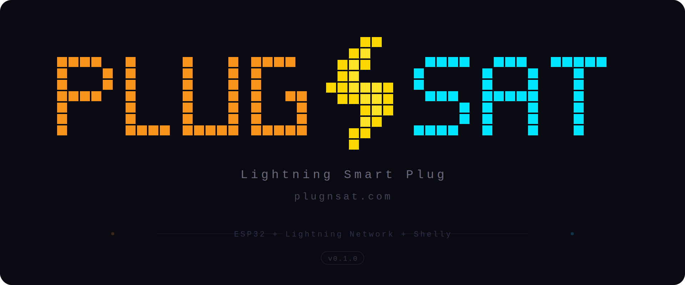

# PlugNSat


An open-source Lightning Smart Plug Controller. Turn any device into a Bitcoin-powered machine!

PlugNSat is an ESP32-based controller that displays a Lightning invoice QR code on screen.
When a customer pays, it triggers a CE-certified Shelly smart plug to power on any connected device (5V, 12V, 220V...) for a configurable duration and price.
Supports BTCPay Server (self-hosted) and Blink (hosted wallet) as Lightning backends.

Connect to WiFi, set your price in sats, and go!
No modification to the target device needed.

Built for Bitcoin hubs, conferences, stores, coworking spaces, companies, meetups, events, and more.

## How it works
```
[QR on screen] --> [Customer scans] --> [Pays Lightning] --> [Shelly ON] --> [New QR]
     ^                                                                          |
     |__________________________________________________________________________|
                              (automatic loop)
```

The QR code is always displayed. No button press needed to start a payment.
QR auto-refreshes every 4m45s before the 5-minute invoice expiry.

## Hardware

| Part | Price | Link |
|------|-------|------|
| LilyGO T-Display S3 | ~20 EUR | [amazon.fr](https://www.amazon.fr/dp/B0BX8Q2MJP) |
| Shelly Plug S Gen3 | ~26 EUR | [amazon.fr](https://www.amazon.fr/dp/B0DJFQXTY2) |

## Arduino IDE Setup

1. Install [Arduino IDE 2.x](https://www.arduino.cc/en/software)
2. Add ESP32 boards: File > Preferences > Board Manager URLs:
   `https://raw.githubusercontent.com/espressif/arduino-esp32/gh-pages/package_esp32_index.json`
3. Install "esp32" in Board Manager
4. Board: ESP32S3 Dev Module
5. USB CDC On Boot: Enabled
6. Flash Size: 16MB
7. Partition Scheme: Minimal SPIFFS (1.9MB APP with OTA/128KB SPIFFS)

### Libraries (Sketch > Include Library > Manage Libraries)

- **TFT_eSPI** by Bodmer (+ configure User_Setup_Select.h for T-Display S3)
  - Line 27: Comment `#include <User_Setup.h>` (add `//` in front)
  - Line 133: Uncomment `#include <User_Setups/Setup206_LilyGo_T_Display_S3.h>` (remove `//`)
- **ArduinoJson** by Benoit Blanchon
- **QRCode** by Richard Moore

## Setup

### 1. Prepare the Shelly Plug

1. Download the **Shelly app** ([iOS](https://apps.apple.com/app/shelly-cloud/id1147164547) / [Android](https://play.google.com/store/apps/details?id=cloud.shelly.smartcontrol))
2. Plug the Shelly into a wall outlet
3. Open the app and follow the instructions to add the device to your WiFi network
4. Once connected, open the plug settings and, under Input/Output settings, configure the Shelly to turn OFF when it has power (so the connected device stays off until a payment is received)

> The Shelly must be on the same WiFi network that PlugNSat will connect to.

### 2. Flash the firmware (DIY only)

> Skip this step if you bought a pre-assembled PlugNSat.

1. Connect the LilyGO T-Display S3 to your computer via USB-C
2. Open Arduino IDE, select the board and settings (see [Arduino IDE Setup](#arduino-ide-setup) above)
3. Upload the firmware
4. The device shows the "PlugNSat Setup" screen

### 3. Configure PlugNSat

1. Power on the PlugNSat via USB-C
2. On your phone, connect to WiFi: `PlugNSat-Setup` (password: `plugnsat21`)
3. Open `http://192.168.4.1` in your browser
4. Enter your WiFi credentials (same network as the Shelly)
5. Choose your Lightning backend (BTCPay Server or Blink) and fill in the corresponding credentials
6. Click **Scan network** to auto-discover your Shelly, or type its hostname/IP manually
7. Set your price in sats, activation duration in seconds, optionally a 4-digit PIN to protect these settings on the device, and optionally a portal password to protect this web page (username: admin)
8. Click **Save and restart**
9. The device connects to WiFi and the QR code appears. You're live!

## Buttons

| Button | Short press | Long press (3s) |
|--------|-------------|-----------------|
| BTN1 (left) | Settings menu / Navigate | Enter AP setup mode |
| BTN2 (right) | Force QR refresh / Confirm | - |

## Firmware Updates

PlugNSat supports over-the-air updates. Two ways to update:

- **Auto-update on boot** (opt-in): enable it in the web portal and the device checks GitHub Releases at every boot, then installs new versions automatically.
- **One-click update**: open `http://plugnsat.local`, click **Check for updates** in the Firmware update section, then **Install update** if a new version is available.

All firmware is RSA-signed. The device verifies the signature before flashing and refuses unsigned or tampered files. If an update fails to boot, the device automatically rolls back to the previous version within 60 seconds.

### Settings menu

Press BTN1 from the QR screen to open the Settings menu.

| Option | Description |
|--------|-------------|
| Device Info | WiFi, IP, RSSI, Shelly host, price, duration, payments, uptime |
| Brightness | Adjust screen brightness (BTN1 decreases, BTN2 increases) |
| Price | Change price in sats (BTN1 decreases, BTN2 increases) |
| Duration | Change activation duration in seconds (BTN1 decreases, BTN2 increases) |
| Turn OFF | Battery model only. Puts the device into deep sleep. Wake with BTN1 or by connecting USB power. |

Price and Duration can be protected with a 4-digit PIN, configurable in the web portal. If a PIN is set, it must be entered before accessing these settings.

Navigation: BTN1 moves the cursor, BTN2 selects. All screens return to the QR code automatically after 6 seconds of inactivity. Changes to Brightness, Price, and Duration are saved automatically on exit. On the Device Info screen, press any button to return to the QR code.

## Files
```
plugnsat.ino   Main sketch, state machine, WiFi, buttons
config.h       Constants, colors, config struct
display.h      All screen rendering (splash, QR, paid, error, info, settings, brightness, AP)
btcpay.h       BTCPay Server API (create invoice, check status)
blink.h        Blink wallet GraphQL API (create invoice, check status)
backend.h      Lightning backend abstraction layer (BTCPay Server, Blink)
shelly.h       Shelly local HTTP API (switch on/off, status)
webportal.h    Web config page (HTML/CSS/JS served by ESP32)
qrcode.h       QR code generation library header (by Richard Moore)
qrcode.c       QR code generation library source
ota.h          OTA system: rollback guard, RSA signature verification, GitHub update check and download
```

All files go in the same folder. Arduino IDE compiles them together.

## Edge Cases Handled

- WiFi disconnects > auto reconnect, QR regenerated
- Backend unreachable > retry 3x, then error screen, auto-retry 10s
- Invoice expires > new QR generated silently
- Shelly offline during payment > "Shelly not found" warning screen > auto-retry every 10s > when Shelly comes back online: paid screen with full countdown + activation command sent with full duration > payment is confirmed regardless of Shelly status
- Shelly hostname (mDNS .local) supported to avoid DHCP IP changes
- "Scan network" button in the web portal auto-discovers Shelly devices via mDNS (no IP needed)
- 60+ consecutive poll errors (5 min) > ESP32 restarts itself
- Long press BTN1 from any screen > AP setup mode

## License

MIT © 2026 - [ezmo-dev](https://github.com/ezmo-dev) (PlugNSat)