# Quick Start Guide

Get your PlugNSat up and running in under 10 minutes. This guide covers everything from opening the box to receiving your first Lightning payment.

> **Pre-assembled unit?** Skip straight to [Step 2: Set up the Shelly Plug](#step-2--set-up-the-shelly-plug). The firmware is already flashed.

## What's in the box

> *Image coming soon*

- 1x PlugNSat device USB-C (LilyGO T-Display S3, pre-flashed)
- 1x 3D-printed enclosure (desk stand, magnetic mount, or wall mount)
- 1x Shelly Plug S Gen3 (CE-certified smart plug)
- 1x USB-C cable (1.5m, braided)
- 1x Quick-start card with QR code to this documentation

## Before you start

You will need:

- A WiFi network (2.4 GHz, the Shelly does not support 5 GHz)
- A smartphone to configure the Shelly and the PlugNSat
- A Lightning backend: **Blink wallet** (easy, no server needed) or **BTCPay Server** (self-hosted, advanced)
- A USB-C power source (phone charger, power bank, laptop USB port, anything)
- Something to power with the Shelly: a lamp, a coffee machine, a phone charger, anything with a plug

## Step 1 — Choose your Lightning backend

PlugNSat needs a Lightning backend to create invoices and detect payments. You have two options:

| | Blink | BTCPay Server |
|---|---|---|
| Difficulty | Easy (5 min) | Advanced (1+ hours if starting from scratch) |
| Cost | Free | Free (self-hosted) or ~5 EUR/month (hosted) |
| Requires | A Blink account | A BTCPay Server instance with Lightning |
| Custody | Blink holds your sats | You hold your keys |
| Best for | Getting started fast, demos, events | Permanent setups, sovereignty, businesses |

**Pick one and follow the matching section below.** You can always switch later from the web portal.

---

### Option A: Set up with Blink (recommended for beginners)

1. Download the **Blink wallet** ([iOS](https://apps.apple.com/app/blink-bitcoin-beach-wallet/id1531383905) / [Android](https://play.google.com/store/apps/details?id=com.galoyapp))
2. Create an account and verify your phone number
3. Go to **Settings > API Keys** in the Blink app or on [dashboard.blink.sv](https://dashboard.blink.sv)
4. Create a new API key and copy it

5. Save your API key in a secure location (password vault) and keep it handy for step 4
6. Keep your wallet ID in a safe place (such as a password manager) and have it handy for Step 4 as well

---

### Option B: Set up with BTCPay Server

If you already have a BTCPay Server instance running with Lightning, you need three things:

1. **Server URL** (e.g. `https://btcpay.yourdomain.com`)
2. **Store ID**
3. **API Key** with the right permissions

#### Find your Store ID

Your Store ID is the long string visible in the URL when you open your store in BTCPay Server. You can also find it in **Settings > Store Settings**.

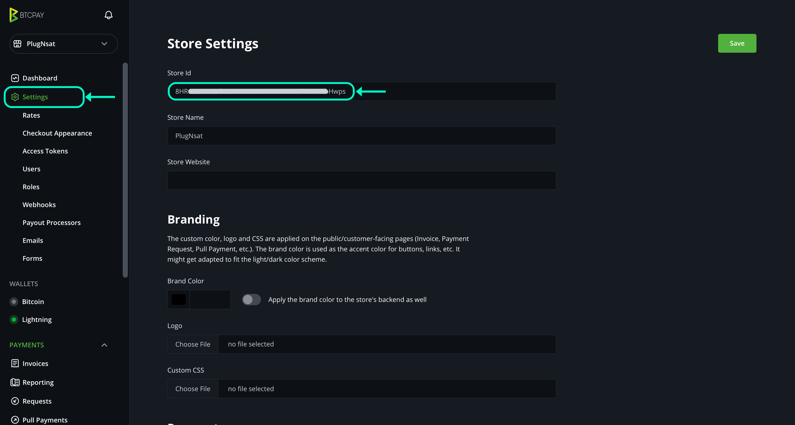

#### Create an API Key

1. In BTCPay Server, go to **Account > Manage Account > API Keys**
2. Click **Generate Key**
3. Check exactly these permissions:
   - `cancreateinvoice` (Create invoices)
   - `canviewinvoices` (View invoices)
   - `canuselightningnode` (Use the Lightning node)
4. Click **Generate**
5. **Copy the key immediately.** It will not be shown again.

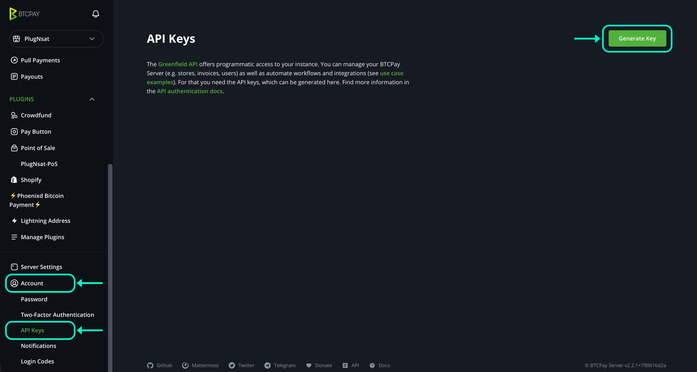
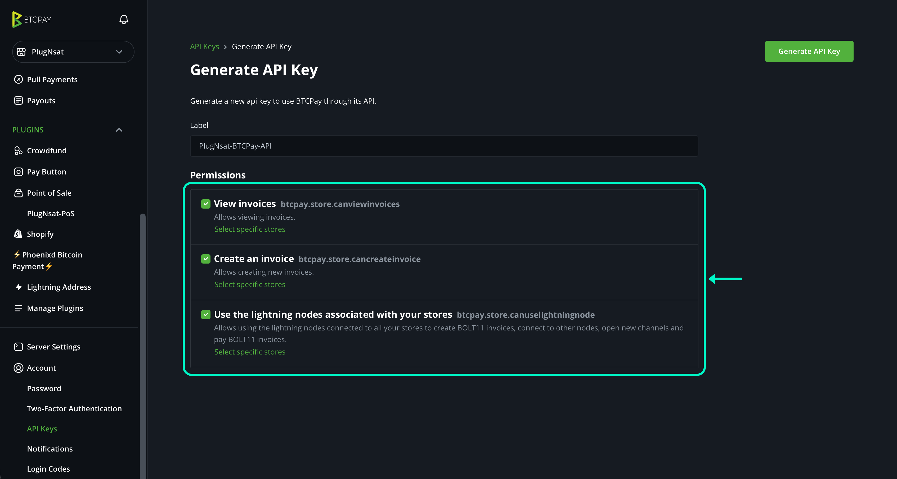

> **Don't have a BTCPay Server yet?** You can set one up for free on your own server by following the [official deployment guide](https://docs.btcpayserver.org/Deployment/), or use a hosted solution like [LunaNode](https://launchbtcpay.lunanode.com/) or [Voltage](https://voltage.cloud/). You will also need a Lightning node connected (Phoenixd, LND, or CLN).

#### Make sure Lightning is working

In your BTCPay Server store, go to **Lightning > Settings** and make sure a Lightning node is connected and operational. You should see a green status indicator.

While you are here, go to **Lightning > Settings** and make sure LNURL is enabled. PlugNSat uses LNURL to generate compact QR codes that are easier to scan on the small screen.

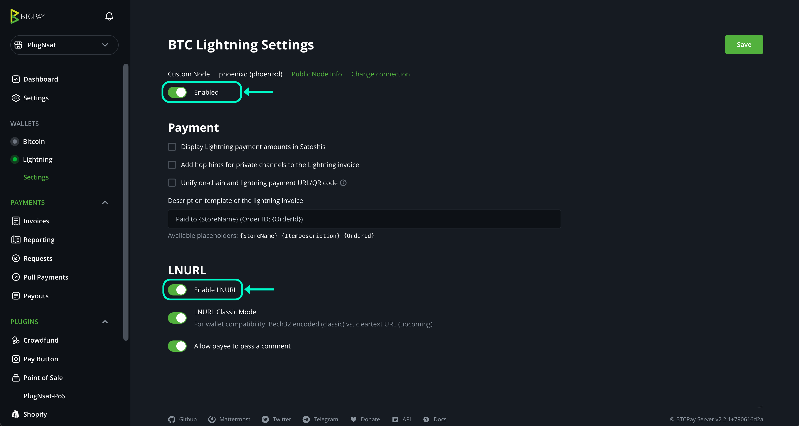

Keep the Server URL, Store ID, and API Key ready for Step 4.

---

## Step 2 — Set up the Shelly Plug
 
The Shelly Plug S Gen3 is the smart plug that PlugNSat controls. It handles the 220V switching safely, is CE-certified, and requires no modification.
 
> **Important:** The Shelly must be on the same Wi-Fi network as your PlugNSat. If you have a dual-band router, make sure both devices are on the 2.4 GHz band.
 
**Pairing the Shelly with the app**
 
1. Download the **Shelly app** ([iOS](https://apps.apple.com/app/shelly-cloud/id1147164547) / [Android](https://play.google.com/store/apps/details?id=cloud.shelly.smartcontrol))
2. Plug the Shelly into a wall outlet. It should flash blue.
3. Make sure your phone is connected to Wi-Fi and that Bluetooth is enabled.
4. Open the app and tap the blue "+" button at the bottom right. Select "Add via Bluetooth". Your Shelly Plug should be detected automatically.

  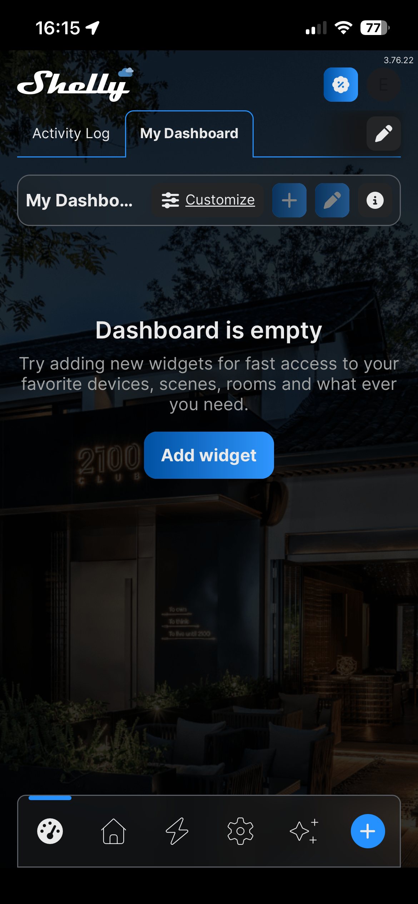
  &nbsp;&nbsp;→&nbsp;&nbsp;
  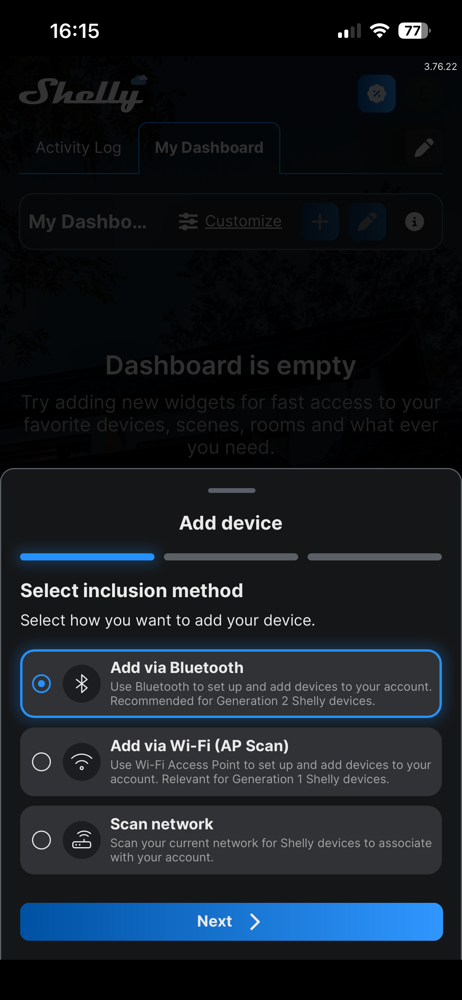
  &nbsp;&nbsp;→&nbsp;&nbsp;
  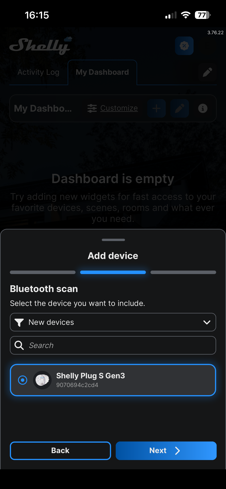

5. Confirm your Wi-Fi network is correct, then tap "Add device" and wait for the setup to finish.

  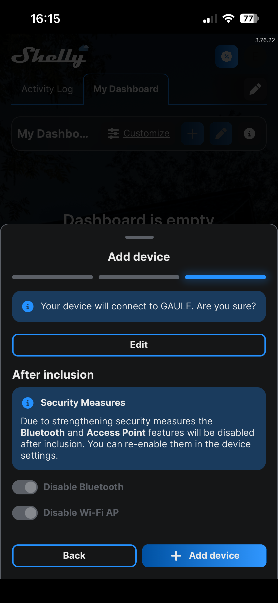
  &nbsp;&nbsp;→&nbsp;&nbsp;
  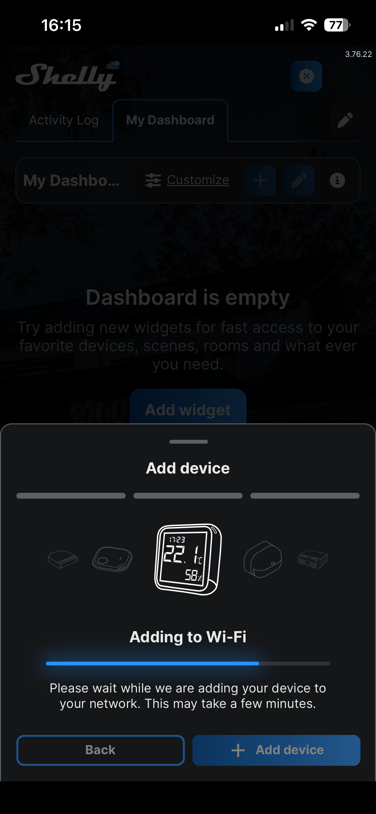
  &nbsp;&nbsp;→&nbsp;&nbsp;
  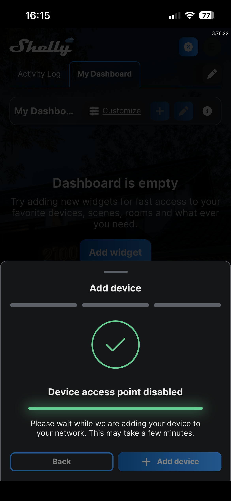

6. Give your Shelly Plug a name so you can identify it if you have several.

  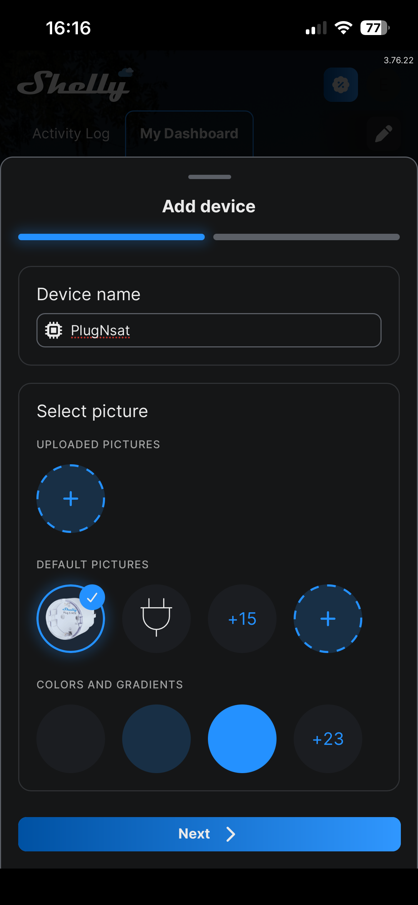
  &nbsp;&nbsp;→&nbsp;&nbsp;
  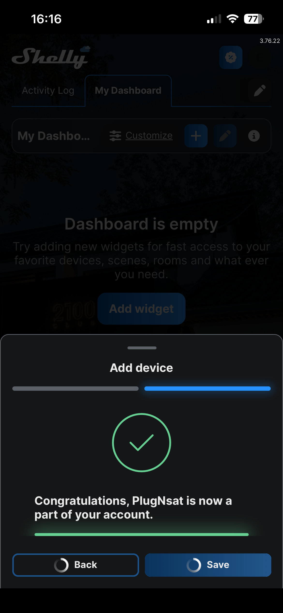

**Configuring the initial state**
 
7. Go to the "All Devices" tab and tap your Shelly Plug. Scroll down to "Settings".

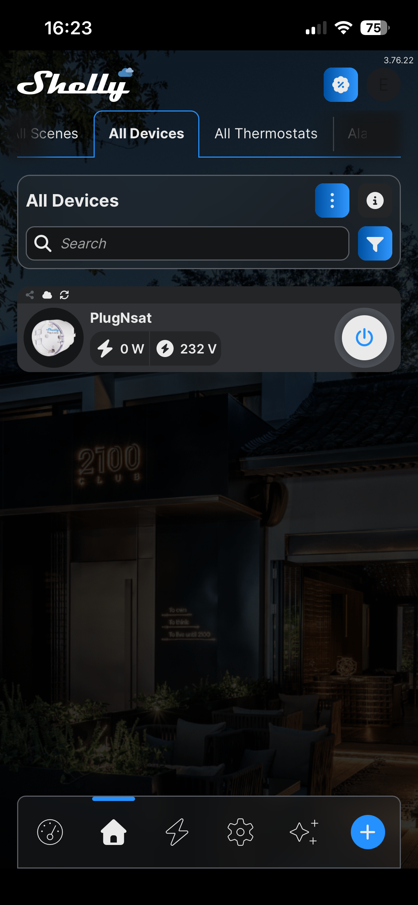

8. Under "Input/Output settings", select: "Configure Shelly device to Turn OFF when it has power." Tap "Save".

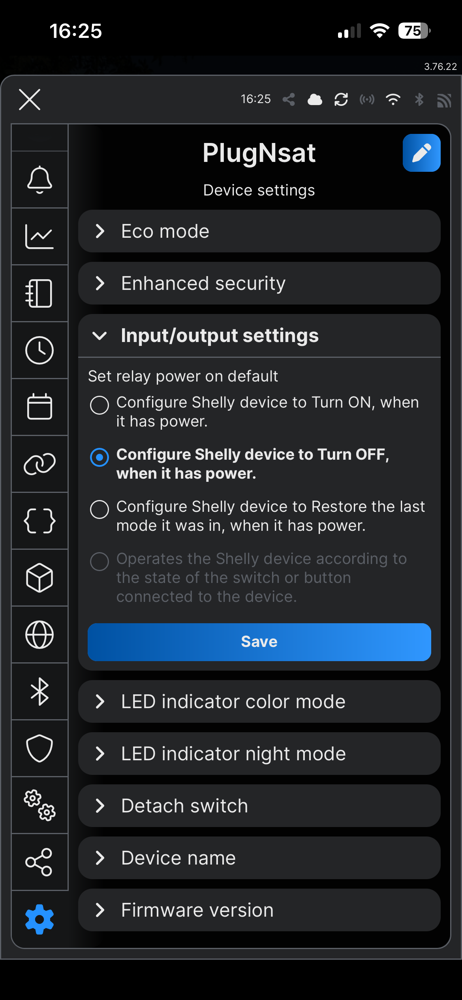

9. Plug your target device (lamp, coffee machine, charger, etc.) into the Shelly. It should stay off.
 