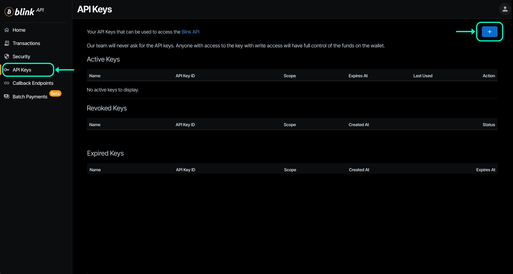
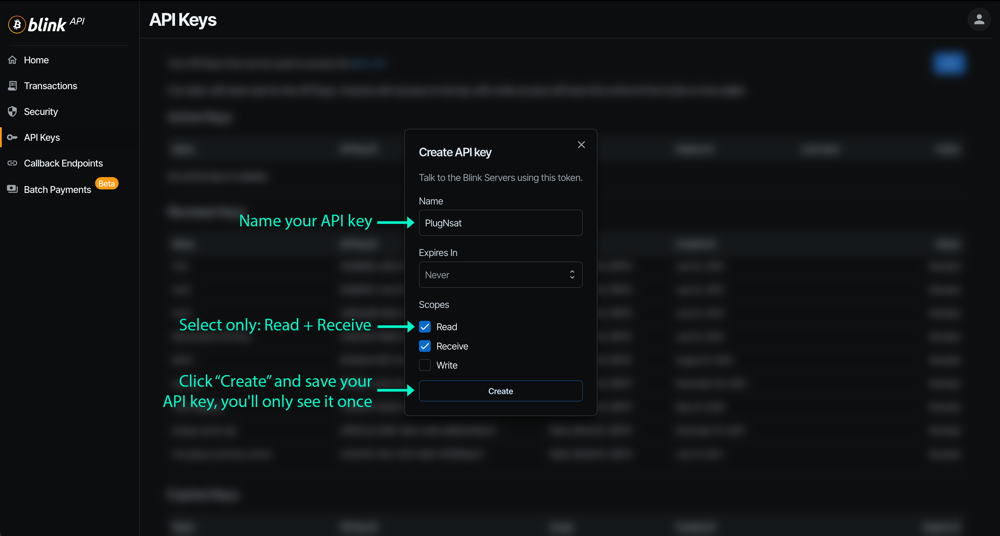
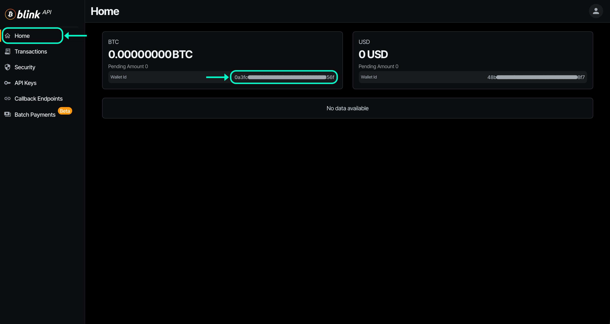

# Quick Start Guide

Get your PlugNSat up and running in under 10 minutes. This guide covers everything from opening the box to receiving your first Lightning payment.

> **Pre-assembled unit?** Skip straight to [Step 2: Set up the Shelly Plug](#step-2--set-up-the-shelly-plug). The firmware is already flashed.

## What's in the box

> *Image coming soon*

- 1x PlugNSat device USB-C (LilyGO T-Display S3, pre-flashed)
- 1x 3D-printed enclosure (desk stand, magnetic mount, or wall mount)
- 1x Shelly Plug S Gen3 (CE-certified smart plug)
- 1x USB-C cable (1.5m, braided)
- 1x Quick-start card with QR code to this documentation

## Before you start

You will need:

- A WiFi network (2.4 GHz, the Shelly does not support 5 GHz)
- A smartphone to configure the Shelly and the PlugNSat
- A Lightning backend: **Blink wallet** (easy, no server needed) or **BTCPay Server** (self-hosted, advanced)
- A USB-C power source (phone charger, power bank, laptop USB port, anything)
- Something to power with the Shelly: a lamp, a coffee machine, a phone charger, anything with a plug

## Step 1 — Choose your Lightning backend

PlugNSat needs a Lightning backend to create invoices and detect payments. You have two options:

| | Blink | BTCPay Server |
|---|---|---|
| Difficulty | Easy (5 min) | Advanced (1+ hours if starting from scratch) |
| Cost | Free | Free (self-hosted) or ~5 EUR/month (hosted) |
| Requires | A Blink account | A BTCPay Server instance with Lightning |
| Custody | Blink holds your sats | You hold your keys |
| Best for | Getting started fast, demos, events | Permanent setups, sovereignty, businesses |

**Pick one and follow the matching section below.** You can always switch later from the web portal.

---

### Option A: Set up with Blink (recommended for beginners)

1. Download the **Blink wallet** ([iOS](https://apps.apple.com/app/blink-bitcoin-beach-wallet/id1531383905) / [Android](https://play.google.com/store/apps/details?id=com.galoyapp))
2. Create an account and verify your phone number
3. Go to **Settings > API Keys** in the Blink app or on [dashboard.blink.sv](https://dashboard.blink.sv)
4. Create a new API key and copy it

5. Save your API key in a secure location (password vault) and keep it handy for step 4
6. Keep your wallet ID in a safe place (such as a password manager) and have it handy for Step 4 as well

---