# User Manual

This document covers everything you need to know about using your PlugNSat day-to-day: what each screen means, how the buttons work, and how to adjust settings directly from the device.

## Overview

PlugNSat operates in a continuous loop:

1. The QR code is displayed permanently on screen
2. A customer scans and pays with any Lightning wallet
3. The screen shows "PAID" and the Shelly plug turns on
4. After the configured duration, the Shelly turns off
5. A new QR code appears automatically

No interaction from the operator is needed. The device runs autonomously.

---

## Buttons

The PlugNSat has two physical buttons on the top edge of the device.

| Button | Position | GPIO |
|--------|----------|------|
| BTN1 | Left (bottom on screen) | GPIO 0 |
| BTN2 | Right (top on screen) | GPIO 14 |

### Button actions

| Context | BTN1 (short press) | BTN1 (long press 3s) | BTN2 (short press) |
|---------|--------------------|-----------------------|--------------------|
| QR screen | Open Settings menu | Enter AP Setup mode | Force QR refresh |
| Settings menu | Move cursor down | Enter AP Setup mode | Select option |
| Brightness | Decrease (-) | Enter AP Setup mode | Increase (+) |
| Price | Decrease (-) | Enter AP Setup mode | Increase (+) |
| Duration | Decrease (-) | Enter AP Setup mode | Increase (+) |
| PIN entry | Change digit (0-9) | Enter AP Setup mode | Confirm digit / Submit |
| Info screen | Return to QR | Enter AP Setup mode | Return to QR |
| AP mode screen | Reconnect to WiFi (if WiFi was configured) | n/a | Reconnect to WiFi |
| WiFi failed screen | Enter AP Setup mode | n/a | Retry connection |
| Error screen | Enter AP Setup mode | Enter AP Setup mode | Retry now (new QR) |
| Shelly offline screen | Return to QR (cancels retry) | Enter AP Setup mode | Return to QR (cancels retry) |

> **Long press BTN1 (3 seconds)** always enters AP Setup mode, from any screen. This is the universal "reconfigure" action. Use it if you need to change WiFi, backend, or Shelly settings.

---

## Screens

### Splash screen

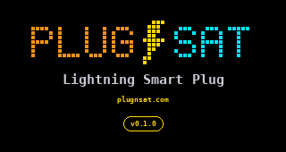

Displayed for 5 seconds on every boot. Shows the PLUG⚡SAT pixel art logo, the tagline "Lightning Smart Plug", the website URL, and the firmware version.

### Connecting

    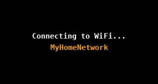
    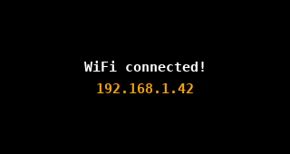

Appears while the device is connecting to your WiFi network. Shows the SSID it is trying to reach. If the connection succeeds, you briefly see the device's IP address before the QR screen loads.

If **Auto-update on boot** is enabled in the web portal, two extra screens may appear after the WiFi connection: "Checking updates..." and, if a new version is found, "Updating... vX.X.X" followed by an automatic reboot. See [Firmware updates](#firmware-updates).

### WiFi failed

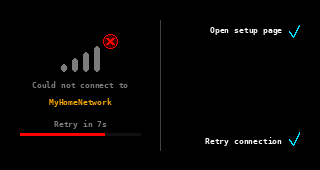

Appears if the device cannot connect to WiFi within 15 seconds. Shows the SSID it tried, a countdown before auto-retry (10 seconds), and two button options: BTN1 to enter AP Setup mode, BTN2 to retry immediately.

### QR code (main screen)

The primary operating screen. The QR code contains an LNURL that any Lightning wallet can scan. The QR auto-refreshes every 4 minutes 45 seconds (before the 5-minute invoice expiry) to always show a valid invoice.

If "Show name" and/or "Show price" are enabled in the web portal, the QR code shifts to the left and an info panel appears on the right side with the device name, price in sats, and the mini PLUG⚡SAT logo.

### Paid

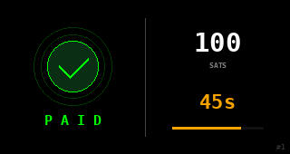

Appears when a payment is received. The screen brightness jumps to 100% to draw attention, and the screen is split in two halves:

- **Left**: a green checkmark with "PAID" underneath
- **Right**: the amount in sats, a countdown timer showing seconds remaining, a progress bar, and the payment counter (e.g. #3 for the third payment since boot)

The Shelly is ON during the entire countdown. When the countdown reaches zero, the Shelly turns off, the brightness returns to its configured level, and a new QR code appears.

### Error

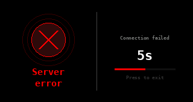

Appears when the PlugNSat cannot reach the BTCPay Server (or Blink). The screen shows "Server error" and "Connection failed", with a countdown and "Press to exit". It retries automatically every 10 seconds.

- **BTN1**: enter AP Setup mode (to fix the configuration)
- **BTN2**: retry immediately

If payment polling fails 60 times in a row (about 5 minutes), the device restarts itself automatically.

> **This is normal.** After a prolonged loss of communication with the Lightning backend, the device reboots to restore a clean state. It will reconnect to WiFi and resume operation on its own. No action is needed from the operator.

### Shelly offline

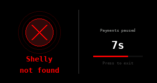

Appears if a payment was received but the Shelly could not be reached. The payment is still considered valid (the customer did pay).

The device automatically retries every 10 seconds. As soon as the Shelly comes back online, it is activated for the **full configured duration**, no matter how long it was offline. The customer paid for the full duration, so they get the full duration.

Pressing any button returns to the QR screen and **cancels the retry**. Only do this if you have handled the situation manually (e.g. activated the Shelly yourself or refunded the customer).

> **Important:** The customer is never charged twice. If the Shelly is offline, the payment still went through on the Lightning side.

### AP Setup mode

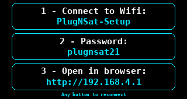

Entered on first boot, or by long-pressing BTN1 (3 seconds) from any screen. The screen shows three boxes with connection instructions:

1. WiFi name: `PlugNSat-Setup`
2. Password: `plugnsat21`
3. URL: `http://192.168.4.1`

If a WiFi network was previously configured, pressing any button exits AP mode and reconnects to WiFi. Button presses are ignored during the first 3 seconds after entering AP mode, to avoid exiting it by accident.

---

## Settings menu

Press **BTN1** (short press) from the QR screen to enter the Settings menu.

    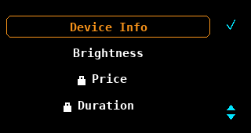
    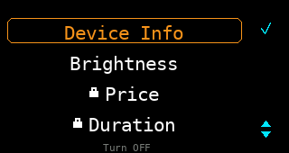

The menu has 4 options on the USB-C model: Device Info, Brightness, Price, and Duration. On the battery model, a 5th option, Turn OFF, appears at the bottom (it puts the device into deep sleep; wake it with BTN1 or by connecting USB power). Use **BTN1** to move between options and **BTN2** to select.

### Device Info

    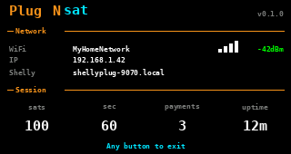
    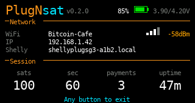

Displays a summary of the current device state. This information is useful for debugging and support:

- Firmware version (top-right corner)
- Battery percentage, icon, and voltage (battery model only)
- WiFi SSID and signal strength (RSSI)
- Device IP address (use `http://<device-IP-address>` to reach the web portal if `http://plugnsat.local` does not work; this IP can change)
- Shelly hostname
- Current price and duration
- Payment count since last boot
- Uptime

Press any button to return to the QR screen.

### Brightness

Adjust the screen brightness. The QR code is displayed in the background at the current brightness so you can see the effect in real time.

- **BTN1**: decrease brightness (minimum: ~4%)
- **BTN2**: increase brightness (maximum: 100%)

A vertical bar and percentage indicator show the current level. The brightness is saved automatically and returns to the QR screen after 6 seconds of inactivity.

> **Tip:** Because this is an LED-backlit screen, maximum brightness is not always best for scanning. A setting around 21% usually gives the cleanest QR code reading, with less glare and better contrast for wallet cameras.

### Price

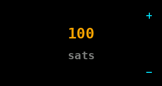

Change the price in satoshis that customers pay per activation.

- **BTN1**: decrease (steps of 10 sats up to 1000, steps of 100 above; minimum: 1 sat)
- **BTN2**: increase (same stepping)

If a PIN is configured (set in the web portal), you must enter it before accessing this screen. The price is saved automatically and returns to the QR screen after 6 seconds of inactivity.

> **Note:** When you change the price, a new QR code is generated automatically with the updated price as soon as you leave this screen.

### Duration

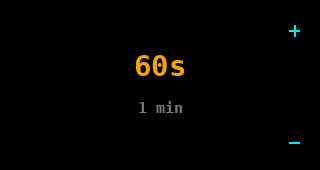

Change how long the Shelly stays on after a payment, in seconds.

- **BTN1**: decrease (steps of 10s up to 300s, steps of 60s above; minimum: 1s)
- **BTN2**: increase (same stepping, maximum: 86400s / 24 hours)

The screen also shows a human-readable conversion (e.g. "5 min", "1h 30min"). If a PIN is configured, you must enter it first. The duration is saved automatically and returns to the QR screen after 6 seconds of inactivity.

> **Note:** Changing the duration takes effect on the next payment, with no QR refresh needed.

### PIN entry

    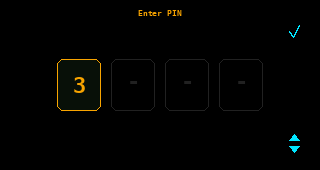
    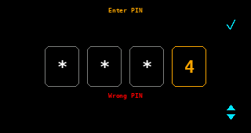

If you set a 4-digit PIN in the web portal, the PIN entry screen appears before accessing Price or Duration settings.

- **BTN1**: cycle the current digit (0 > 1 > 2 > ... > 9 > 0)
- **BTN2**: confirm current digit and move to next (or submit on the 4th digit)

Previous digits are masked with `*`. If the PIN is wrong, the screen flashes "Wrong PIN" and resets after 1.5 seconds. The PIN screen has a 15-second timeout (returns to settings if inactive).

---

## Firmware updates

PlugNSat can update its own firmware over WiFi. Updates are downloaded from the official PlugNSat releases and verified with a cryptographic signature before installation, so only authentic firmware can be installed.

There are two ways to update, both managed from the web portal:

### Manual update (recommended)

1. Open the web portal (device IP address or `http://plugnsat.local`)
2. In the **Firmware update** section, click **Check for updates**
3. If a new version is available, click **Install update**
4. The device downloads the firmware, verifies it, and reboots on the new version

You stay in full control: nothing is installed without your action.

### Auto-update on boot (opt-in)

Enable the **Auto-update on boot** checkbox in the web portal. From then on, every time the device restarts, it checks for a new version right after connecting to WiFi and installs it automatically. You will see "Checking updates..." and, if an update is found, "Updating... vX.X.X" before the device reboots.

If the update check or download fails, the device simply continues booting normally with its current firmware.

> **Tip:** The current firmware version is visible on the splash screen and on the Device Info screen.

---

## Auto-behaviors

These things happen automatically without any user action:

| Behavior | Trigger | What happens |
|----------|---------|--------------|
| QR refresh | Every 4 min 45 sec | New invoice created, QR updated silently |
| WiFi reconnect | WiFi connection lost | Automatic reconnection attempt |
| Error recovery | BTCPay/Blink unreachable | Retry every 10 seconds |
| Shelly retry | Shelly offline after payment | Retry every 10 seconds, full duration when back online |
| Auto-restart | 60 consecutive polling errors (~5 min) | ESP32 reboots itself |
| Auto-update | On boot, if enabled in web portal | Checks for new firmware, installs and reboots |
| Screen timeout | No button press for 6 sec (settings, brightness, price, duration) | Returns to QR screen, saves changes |
| PIN timeout | No button press for 15 sec | Returns to settings menu |

---

## Tips for daily use

- **Leave it running.** PlugNSat is designed to run continuously without intervention. When powered over USB-C (both the USB-C model and the battery model plugged in), it runs 24/7. On battery alone, the battery model runs for as long as the charge lasts.
- **Check the payment counter.** The number in the bottom-right of the Paid screen (#1, #2, #3...) counts payments since the last boot. Useful to know how many customers used it during the day.
- **Adjust price and duration on the fly.** No need to open the web portal for quick changes. Use the buttons (BTN1 from QR > Price or Duration).
- **Use a PIN** if the device is in a public place and you don't want someone to change the price or the duration.
- **The web portal is always available** at `http://plugnsat.local` or at the device's IP address on the same WiFi network. You can access it from your phone or laptop.
- **Keep your firmware up to date.** Check for updates from the web portal once in a while, or enable auto-update on boot if you prefer a hands-off approach.
- **Brightness matters for QR scanning.** A setting around 21% usually gives the cleanest QR read on this LED-backlit screen. If customers still have trouble scanning, adjust the brightness up or down. Screen reflections on the LCD can be an issue in bright environments.