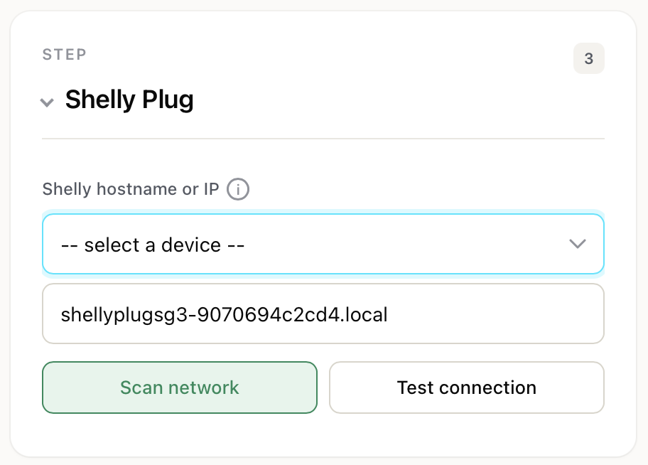
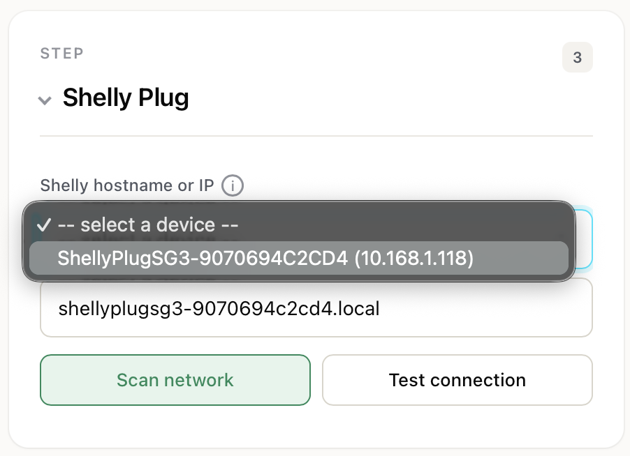
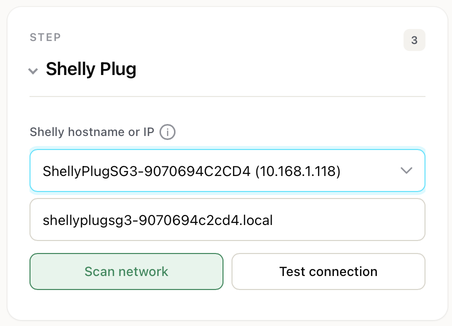
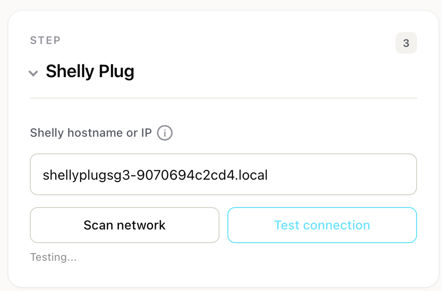
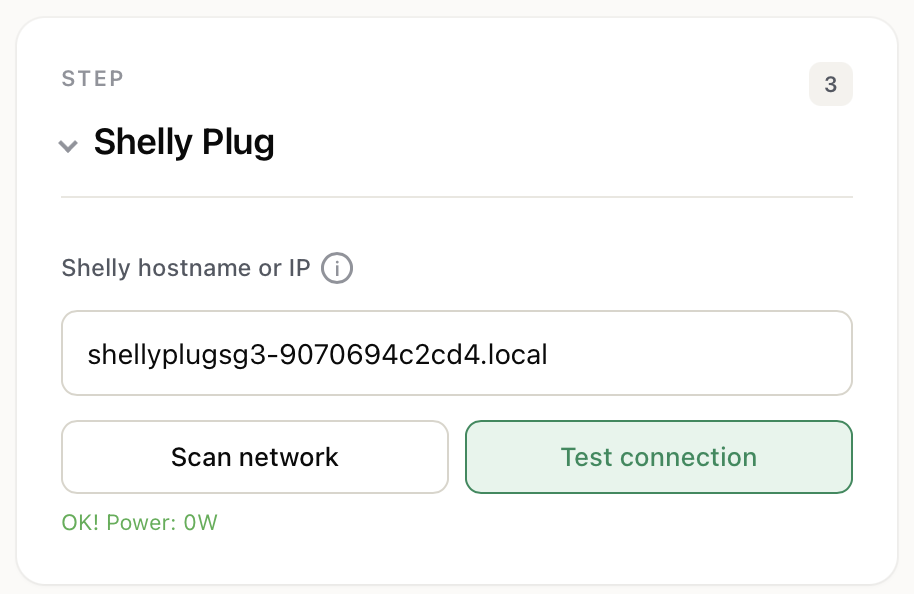
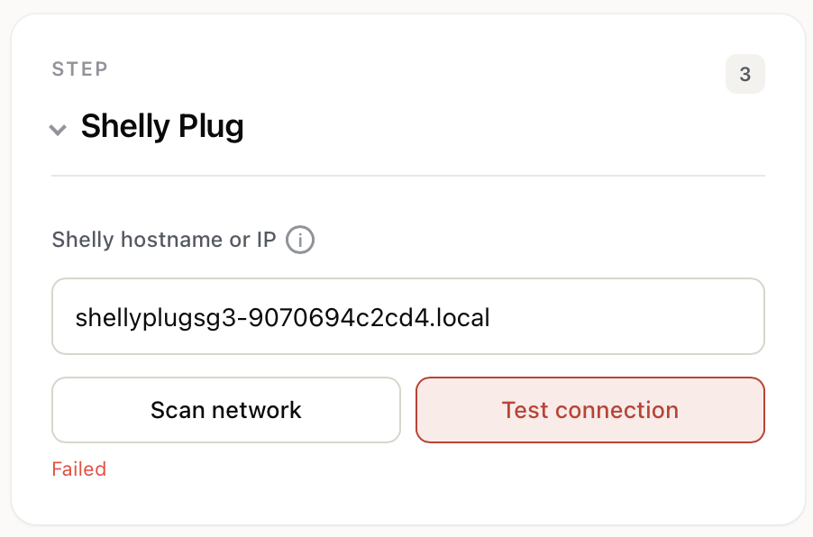
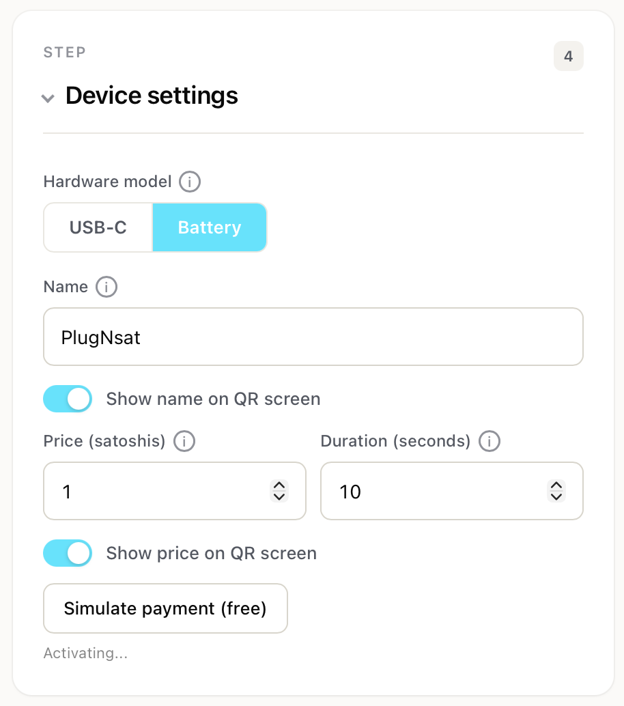
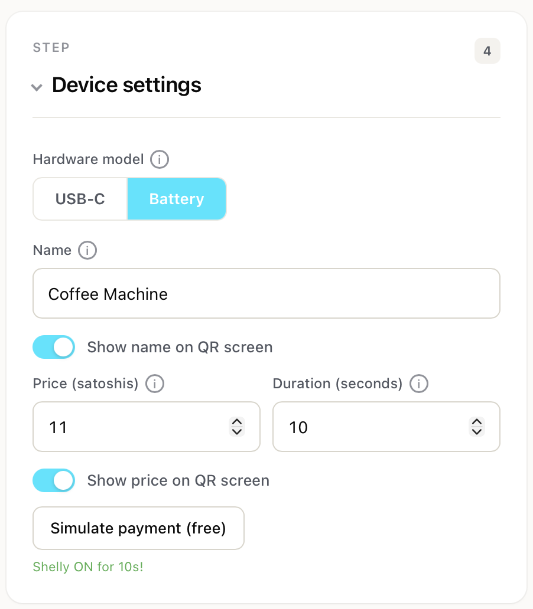

# Web Portal Reference

The web portal is the configuration interface served by the PlugNSat itself. It runs directly on the ESP32 and is accessible from any browser on the same network.

## How to access the web portal

There are two ways to reach the web portal depending on the device's current state:

**During first setup (AP mode):**

1. Connect your phone to WiFi: `PlugNSat-Setup` (password: `plugnsat21`)
2. Open `http://192.168.4.1` in your browser

**After setup (normal mode):**

1. Connect to the same WiFi network as the PlugNSat
2. Find the device's IP address (shown on the Device Info screen: BTN1 from QR > Device Info)
3. Open `http://<device-ip>` in your browser, or use `http://plugnsat.local` (mDNS)

> The web portal works on any modern browser: Safari, Chrome, Firefox, on both mobile and desktop. No app needed.

> In AP mode the portal is never password-protected, so you can never lock yourself out during setup. A Web Access Password (see Step 5) only applies in normal mode on your WiFi.

---

## Configuration fields

The portal is organized in 5 steps. All fields are saved at once when you press **Save and restart**. Each step can be collapsed or expanded by tapping its title; the collapsed state is remembered in your browser.

### Step 1: WiFi

| Field | Description | Example |
|-------|-------------|---------|
| **SSID** | Your WiFi network name (2.4 GHz). The Shelly must be on the same network. | `MyHomeWiFi` |
| **Password** | Your WiFi password. | `********` |

> The Shelly Plug S Gen3 only supports 2.4 GHz networks. If your router broadcasts both 2.4 and 5 GHz under the same name, you may need to separate them or force the 2.4 GHz band.

> For security, saved passwords are never sent back to the browser. Existing values appear as `********`. Leave them untouched to keep the current password, or type a new one to replace it.

### Step 2: Lightning Backend

PlugNSat supports two Lightning backends. Select one from the **Backend** dropdown; the form shows only the fields for the selected backend.

| Backend | When to use |
|---------|-------------|
| **BTCPay Server** | You run your own server. Full control, no middleman. |
| **Blink** | A ready-to-use wallet, no server needed. Sign up at `blink.sv`. |

#### BTCPay Server fields

| Field | Description | Example |
|-------|-------------|---------|
| **Server URL** | The full URL of your BTCPay Server instance. No trailing slash. | `https://btcpay.mydomain.com` |
| **API Key** | Your BTCPay Greenfield API key. Must have the correct permissions (see below). | `a1b2c3d4e5...` |
| **Store ID** | Your BTCPay Store ID. Found in Settings > General or in the URL. | `8HRcCq...HwPs` |

##### Required API key permissions

The API key must have exactly these three permissions enabled:

| Permission | Internal name | Why it's needed |
|------------|---------------|-----------------|
| Create invoices | `cancreateinvoice` | To generate Lightning invoices when a customer scans the QR |
| View invoices | `canviewinvoices` | To check if an invoice has been paid (polling) |
| Use Lightning node | `canuselightningnode` | To retrieve the LNURL from the invoice's payment methods |

To create a key: BTCPay Server > Account > Manage Account > API Keys > Generate Key > check the three permissions > Generate > copy immediately.

##### How it works technically

When a QR code needs to be generated, the PlugNSat:

1. Creates an invoice via `POST /api/v1/stores/{storeId}/invoices` with amount in BTC, payment methods `BTC-LN` and `BTC-LNURL`, and a 5-minute expiry
2. Fetches the payment methods via `GET /api/v1/stores/{storeId}/invoices/{id}/payment-methods`
3. Extracts the LNURL from the `BTC-LNURL` payment method's `paymentLink` field
4. Displays the LNURL as a QR code (much shorter than a BOLT11 invoice, which makes the QR simpler and easier to scan on the small LCD)
5. Polls the invoice status every 5 seconds via `GET /api/v1/stores/{storeId}/invoices/{id}` and checks for `Settled` or `Processing`

#### Blink fields

| Field | Description | Example |
|-------|-------------|---------|
| **API Key** | Your Blink API key. Generate one at `dashboard.blink.sv` under API Keys. | `blink_...` |
| **BTC Wallet ID** | Which wallet receives the sats. Found at `dashboard.blink.sv`. | `f79a...` |

> Blink uses the GraphQL API at `https://api.blink.sv/graphql` (fixed endpoint, no server URL to enter). It returns a BOLT11 invoice rather than an LNURL, so the QR code is longer than with BTCPay but still scannable easily.

### Step 3: Shelly Plug

| Field | Description | Example |
|-------|-------------|---------|
| **Shelly hostname or IP** | The address of your Shelly on the local network. Can be an IP or an mDNS hostname. | `shellyplugsg3-9070694c2cd4.local` |

> Make sure the Shelly is plugged in, on the same WiFi, and set to **Off** as its default power-on state.

#### Scan network

Click **Scan network** to auto-discover Shelly devices on the local network via mDNS. The PlugNSat queries `_http._tcp` services and keeps the ones whose hostname starts with `shelly`. Matches appear in a dropdown for easy selection.

    
    
    

> **Tip:** Use the mDNS hostname (`.local`) instead of the IP address. IP addresses can change if your router assigns a new one via DHCP. The mDNS hostname stays the same.

#### Test connection

Click **Test connection** to verify the PlugNSat can reach the Shelly. It sends an HTTP request to the Shelly's status endpoint (`/rpc/Switch.GetStatus?id=0`). If successful, you see a green confirmation with the current power draw in watts.

    
    
    

#### How the Shelly is controlled

The PlugNSat communicates with the Shelly via local HTTP API (Shelly Gen2+ RPC). No cloud, no internet, no firmware modification.

| Action | Endpoint |
|--------|----------|
| Turn on (with auto-off timer) | `GET /rpc/switch.set?id=0&on=true&toggle_after={seconds}` |
| Turn off | `GET /rpc/switch.set?id=0&on=false` |
| Check status | `GET /rpc/Switch.GetStatus?id=0` |

The `toggle_after` parameter tells the Shelly to turn itself off after the configured duration. This means even if the PlugNSat loses power or WiFi, the Shelly will still turn off on time.

### Step 4: Device settings

| Field | Description | Default | Range |
|-------|-------------|---------|-------|
| **Name** | Display name for your PlugNSat. Shown on the info panel next to the QR if enabled. | `PlugNSat` | 1 to 40 characters (max 18 when "Show name" is on) |
| **Show name on QR screen** | Toggle. When on, the name appears next to the QR code. | Off | On/Off |
| **Price (satoshis)** | The amount a customer pays per activation. | `100` | 1 to 1,000,000 sats |
| **Duration (seconds)** | How long the Shelly stays on after payment. | `60` | 1 to 86400 (24h) |
| **Show price on QR screen** | Toggle. When on, the price in sats appears next to the QR code. | Off | On/Off |

> **Name length and QR layout:** If "Show name" is enabled, the QR code shifts to the left to make room for the info panel. Long names (more than 9 characters) wrap to two lines. With display enabled the portal enforces a maximum of 18 characters; with display off the limit is 40.

#### Simulate payment

Below the device fields you will find a **Simulate payment (free)** button. This triggers the Shelly for the configured duration without creating a real Lightning invoice or spending any sats.

    
    

This is useful for:
- Testing the Shelly connection during setup
- Demoing the product without needing a Lightning wallet
- Verifying the device works end-to-end

### Step 5: Security

| Field | Description | Default | Range |
|-------|-------------|---------|-------|
| **Device PIN** | Optional 4-digit code that protects Price and Duration on the device buttons. | Empty (disabled) | 4 digits or empty |
| **Web Access Password** | Optional password to protect this configuration page in normal mode. Login username is always `admin`. | Empty (disabled) | Any length or empty |

> The Device PIN prevents anyone near the PlugNSat from changing price and duration with the physical buttons. The Web Access Password prevents anyone on your WiFi from opening this page. The password is always disabled in setup (AP) mode so you cannot lock yourself out.

---

## Firmware update

Below the **Save and restart** button is a Firmware update card. It shows the current firmware version and lets you keep the device up to date.

| Option | Behavior |
|--------|----------|
| **Auto-update on boot** | When enabled, the device checks GitHub Releases for a newer version every time it restarts and installs it automatically. Leave it off to stay in full control. |
| **Check for updates** | Manual check. Queries the GitHub Releases API over HTTPS and reports whether a newer version is available. Shown only when auto-update is off. |

Updates are verified with an RSA-SHA256 signature before flashing, so an unsigned or tampered firmware is refused.

---

## After saving

When you click **Save and restart**:

1. All settings are saved to the ESP32's non-volatile memory (NVS)
2. The device reboots
3. It connects to the configured WiFi
4. A new QR code is generated with the new settings

Settings persist across reboots and power losses. The only way to lose them is a firmware reflash or a factory reset.

---

## Accessing the portal in normal mode

After setup, the web portal remains accessible at the device's IP address or at `http://plugnsat.local`. You can change any setting at any time by visiting this page from your phone or laptop on the same network.

The IP address is displayed on the **Device Info** screen (BTN1 from QR > Device Info). You can also find it in your router's admin panel under connected devices, usually listed as "plugnsat" or "espressif".